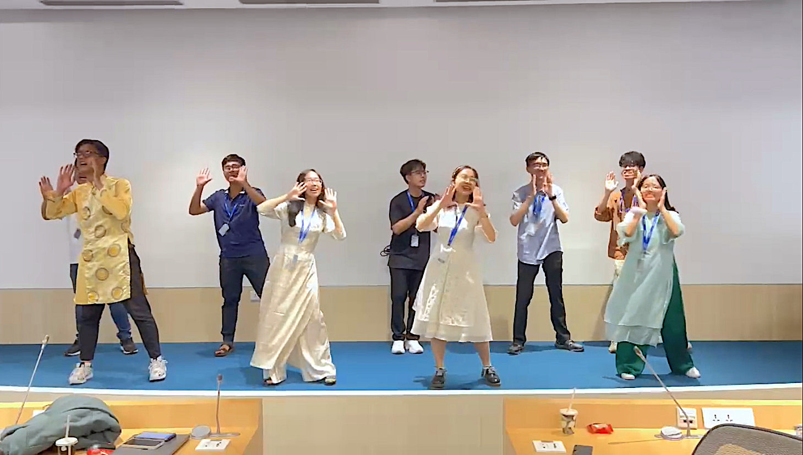

*Đọc bản tiếng Việt ở [đây](https://nnphuyen.netlify.app/blog/bengaluru-bgsv-những-người-bạn-và-7-ngày-diệu-kỳ-ở-ấn/) nhé!*

### **Table of Contents**

**[Introduction](#h-introduction)**
**[Chapter 1: first flight](#h-chapter-1-first-flight)**
**[Chapter 2: exploring the city](#h-chapter-2-exploring-the-city)**
**[Chapter 3: meet&greet in Koramangala](#h-chapter-3-meet&greet-in-koramangala)**
**[Chapter 4: wonders of Adugodi](#h-chapter-4-wonders-of-adugodi)**
**[Chapter 5: 6 special nights in Bangalore](#h-chapter-5-6-special nights-in-bangalore)**
**[Chapter 6: Indian cuisine](#h-chapter-6-indian-cuisine)**

### **Introduction**

This blog recounts my wonderful 7-day experience in the city of Bangalore, India — a country I never imagined I would visit. The trip was part of a fully-sponsored talent exchange program by Bosch Global Software Technologies Vietnam (BGSV), bringing together 9 friends from Code Race and the Activator Scholarship. We had the opportunity to explore the tech city of Bangalore, experience and learn about Bosch's advanced technologies, receive technical training and hands-on practice in automotive automation, and much more.

### **Chapter 1: first flight**

Actually, this was my first time flying. I always thought my first flight would be to some travel destination within Vietnam, but it turned out to be the journey I had always dreamed of as a child — a fully sponsored trip from my favorite company, Bosch.

For my first flight, I was lucky (at least, that’s how I felt) to have a window seat, allowing me to gaze at the blue sky. It was delightful. The first person I talked to was Trang, as she sat next to me on the plane, followed by Phuong and then the others. Our group’s first proper interaction happened during our transit at Kuala Lumpur Airport, where we chatted and connected on social media. At that moment, I realized how enjoyable it was to meet new friends with similar interests. I was extremely excited because I had always hoped to experience such things since my middle and high school days. I was even more surprised to find that I wasn't the only one who had deleted Facebook, hehe; several others in the group had done the same. I often got teased by my friends for deleting Facebook and being out of the loop with trends and news. So, meeting a group of friends who were just like me made me incredibly happy.

After a nearly 5-hour flight, our group finally arrived in Bangalore, India. The airport was incredibly spacious and beautiful. We were warmly welcomed, even receiving flower garlands, a charming Indian tradition. This gesture demonstrated their respect and affection for guests.

### **Chapter 2: exploring the city**

On our first day in Bangalore, the group toured one of the most advanced tech cities in India, often referred to as the Silicon Valley of Asia. We visited six destinations in a single day, and rather than feeling tired, we had an incredible amount of fun! Our adventures took us to the Summer Palace, Kalasipalyam Fort, a traditional Indian market, Bangalore Palace, Lalbagh Botanical Garden, and finally, we ended our day with lots of laughter at a saree fabric store.

At Sultan Tipu's Summer Palace, an Indian guide explained the Indo-Islamic architecture of the palace and shared legends about Sultan Tipu. Although he spoke a lot and very quickly with an Indian accent, making it hard for me to catch everything, I learned that the palace was entirely built from wood, stone, and mud in the 18th century. It has 160 pillars, some of which reach up to the ceiling, and the walls and ceilings are adorned with geometric patterns and floral designs that reflect the artistic style of that period and are still preserved today.

Afterward, we visited the fort at Kalasipalyam. Honestly, the fort was quite small, lacking the grandeur and extensive sights to explore. However, while there, we learned about the legends of the gods Shiva and Ganesha, two important deities in Indian mythology.

A few hundred meters from the fort was the enormous traditional market of the Indian people, where I could vividly sense the essence of everyday life in India. Three words to describe the scene there: COLOR, AROMA, and UNCLEANLINESS. The scenery was truly impressive with a plethora of colors woven into the flowers and fruits. In Indian culture, flowers play a crucial role; every household buys flowers not only for festivals but also for daily life. Flowers are usually sold in bundles, by the meter (I thought), or as individual stems, similar to Vietnam. Southern India is a tropical country, so the variety of fruits is extremely diverse. Everything contributed to a harmonious and colorful scene in the bustling market.

Indian cuisine always leaves a lasting impression with its strong and distinctive flavors, so it wasn't hard to spot the small towers of spices being sold all around the market. Consequently, the air was filled with a strong scent, a mixture of spicy, fragrant, and savory aromas. Before coming to India, I had watched countless videos about the country, many of which focused on the hygiene issues faced by its people. I had to confirm that what I saw online was mostly accurate; except for restaurants and within companies, cleanliness was lacking in most places. Delving deeper into the market, this became even more apparent. People were sleeping amidst piles of garbage, and rats scurried around, creating a chaotic scene. Yet, these aspects contribute to the incredibly unique and vibrant culture of India, reflecting the strong character of its people.

The morning city tour concluded with a visit to the Bangalore Palace. The palace is built in Tudor architecture, a medieval style from England, so it gives the impression of ancient European castles. We explored the entire palace, with our guide, Khôi, introducing us to its history. Each room told a story, and each artifact reflected the heritage of the Bangalore royal family during that era. Today, the palace has been repurposed as a museum, preserving the ancient historical values of the Mysore period.

The afternoon began with a visit to Lalbagh Botanical Garden, a vast area dedicated to the conservation of plants in Bangalore. Here, there is a giant rock that has existed for thousands of years, with a greenhouse displaying various flowers—modeled after the Crystal Palace in England. We didn't explore much of the botanical garden; instead, we simply walked around together and enjoyed some ice cream. However, I noticed that everyone became closer to each other after spending time together at Lalbagh Botanical Garden.

When it comes to Indian attire, people often think of the extravagant and intricate sarees worn by women. This is the traditional attire and also the daily wear for most Indian women. Therefore, we couldn't miss out on visiting their traditional fabric stores to learn more about and experience the culture of this South Asian country. Here, we wandered around, explored, made a few jokes, and laughed together, further strengthening our bond.

### **Chapter 3: meet&greet in Koramangala**

BGSW in Bangalore has two main campuses, located in Koramangala and Adugodi. We started our journey in Koramangala, then spent 5 days in Adugodi, before concluding our trip back in Koramangala.

The first group meeting with the BGSW colleagues took place in Koramangala, right next to our accommodation. We were warmly welcomed with an ice-breaker session, introductions, and mingling. We met Linkesh, Praneeth, and Arun—our associates from BGSW who would be with us on this trip. Additionally, we had the honor of meeting and interacting with the senior leaders of BGSW in India.

Afterward, we had lunch with everyone, and the hospitality was exceptional. Each team member was paired with an Indian colleague so that everyone could engage in conversations and not feel left out. With such a large group, it would have been challenging to focus on one topic, so this arrangement ensured everyone felt included. 

### **Chapter 4: wonders of Adugodi**

In the following days, we toured and learned at Bosch Adugodi. We participated in technical training sessions while experiencing and gaining insights into Bosch. Speaking of the landscape, Bosch Adugodi spans approximately 300,000 square meters, an incredibly vast campus. The office buildings, labs, workshops, and even the exhibition area are beautifully constructed, and adorned with plenty of greenery. There's even a pedestrian bridge within the campus for convenient employee movement. Another adorable feature here is the presence of rescue dogs and cats on the company premises—yes, you heard that right, rescue dogs and cats. How lovely is that? So adorable!

We participated in technical sharing sessions conducted by BGSW associates to tackle the challenge of autonomous maze-solving vehicles. Not only were we taught, but we also visited research centers and learned about Bosch to understand why Bosch truly embodies the #Inventedforlife - innovative spirit. Observing everyone work diligently, and collaborating to create useful values for life, inspired and motivated us immensely to strive harder. We witnessed and experienced Bosch's innovations from the late 19th century—the early days of its establishment—to technologies that haven't even been released to the market yet. I was genuinely surprised by what Bosch has accomplished and is contributing to the new generation, to technology, and to society. It made me understand why a business can endure for hundreds of years.

Not only did we learn about technology and explore Bosch, but we also exchanged cultures with our Indian associates. We had two dance workshops and performed a Vietnamese cultural piece to introduce Tet (Vietnamese Lunar New Year) to everyone. We danced a segment of "Tết đong đầy" by KHOA x Kay Tran x Duck V. Our Indian friends also dedicated a wonderful song to us, although we didn't know the title, the melody, and their voices still made us feel it was a great song. Beyond art, we also shared differences in culture, people, education, and even business between Vietnam and India. 

The five days in Adugodi would have been incredibly challenging without the helpful and attentive support of Linkesh, Praneeth, and Arun. Concepts that were previously unfamiliar, such as embedding, automation, and security, would have been dry and difficult to understand without the guidance of Đăng, our team's eldest brother. He was always there, supporting us in every aspect, not only in Adugodi but throughout the entire journey. We also had the pleasure of meeting and chatting with the lovely sisters Phụng and Vân Anh from BGSV, as well as meeting and chatting with Vietnamese associates working in India. And let's not forget the dedicated mentors who assisted and guided our team to complete the challenges, as well as our Indian associates who were enthusiastic and open-minded throughout the five days in Adugodi.

### **Chapter 5: 6 special nights in Bengaluru**

For me, this trip wouldn't have been complete without the nightly "Reflection" sessions with sister Vân Anh and the late-night chats with friends. At the end of each day, we would sit down together to reflect on our achievements, regrets, and expectations for the next day. We also analyzed our own SWOT (Strengths, Weaknesses, Opportunities, Threats). I believe this was when I learned the most because only by being still, thinking, writing, and speaking out could I remember and understand better.

We talked a lot, especially me and Trang—we could chat endlessly, to the point where we were separated because we kept talking and laughing too much. But it was so much fun, that was my favorite time of the day.

Starting each day at 8 AM and ending at 11 PM, but where was the time to practice dancing for the cultural exchange session? It was precisely from 11 PM onwards, haha. Even after finishing the "Reflection" session each day, we still had plenty of energy to continue our late-night conversations. We talked a lot—about relationships, mindset, ourselves, music, studying, you name it, we shared everything with each other. Perhaps this is why we understood each other better and became closer. I learned and clearly felt the "Can-do" mindset of VinUni, got closer to the brilliant students, and heard about the experiences of others on different exchange trips, which made me see the world broader. I learned more about the culture from North to South through their stories and picked up many smooth curses from Trang. Not only did we chat together, but Trang and I also discussed various trivial matters. I also had a night chat with Phương while preparing for the cultural exchange session. 

### **Chapter 6: Indian cuisine**

One of the first things I prepared for this trip was medicine—antacids, digestive aids, pain relievers, antidiarrheals, anti-nausea—because, of course, I was afraid of unfamiliar Indian food. I'm usually an adventurous eater and adapt quickly, but the numerous warnings and watching many videos online made me psychologically fearful. So, I prepared extensively to give myself an escape route if needed.

But luckily, Indian food turned out to be amazing, at least for me. Two dishes that I remember the most are Chapati and Gulab Jamun: one because it's easy to eat and I like it, especially with various curries, which is Chapati; and the other because of its adorable symbolism—Gulab Jamun, as it is round and symbolizes a girl's blushing cheeks when she smiles. Indian dishes have distinct flavors—salty, spicy, sweet, and tangy (yogurt), and I don't think I've ever tasted tanginess in Indian food before.

For everyday meals, everyone would pick food according to their preferences and put them in separate small bowls. Like in the videos, Indians often eat various types of flour-based bread with their meals, rice accompanied by curries, and a meal can have up to 2-3 different types of curries, ranging from mild to very spicy. As for restaurant meals, I found them plentiful, truly abundant for Vietnamese standards, as most of us were already full after appetizers, without even touching the main course. Overall, the food is diverse, so you'll surely find something suitable for you in this rich culinary landscape.

