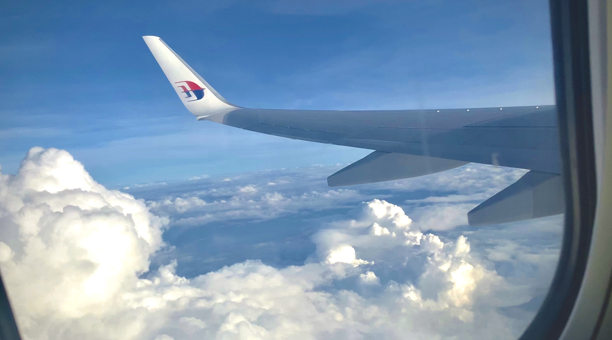

*Please check for English version [here](https://nnphuyen.netlify.app/blog/bangalore-bgsv-the-wonderful-friends-and-7-magical-days-in-india/)!*

### **Mục lục**

**[Giới thiệu](#h-giới-thiệu)**
**[Chương 1: lần đầu bay](#h-chương-1-lần-đầu-bay)**
**[Chương 2: khám phá thành phố](#h-chương-2-khám-phá-thành-phố)**
**[Chương 3: gặp gỡ ở Koramangala](#h-chương-3-gặp-gỡ-ở-koramangala)**
**[Chương 4: những điều kỳ diệu ở Adugodi](#h-chương-4-những-điều-kỳ-diệu-ở-adugodi)**
**[Chương 5: 6 đêm đặc biệt ở Bengaluru](#h-chương-5-6-đêm-đặc-biệt-ở-bengaluru)**
**[Chương 6: ẩm thực Ấn Độ](#h-chương-6-ẩm-thực-ấn-độ)**

### Giới thiệu

Đây là blog mình chia sẻ lại trải nghiệm 7 ngày tuyệt vời ở thành phố Bengaluru, Ấn Độ - một quốc gia mà có lẽ chưa bao giờ mình nghĩ sẽ đặt chân đến. Chuyến đi là chương trình trao đổi tài năng được tài trợ hoàn toàn bởi công ty Bosch Global Software Technologies Vietnam (BGSV) với 9 người bạn được tập hợp từ Code Race và Activator Scholarship. Bọn mình được tham quan thành phố công nghệ Bengaluru, được trải nghiệm, tiếp xúc và học hỏi các công nghệ tiên tiến của Bosch, được dạy và thực hành những kiến thức về tự động trong ô tô và rất nhiều những điều khác nữa.

### Chương 1: lần đầu bay

Đây là lần đầu mình bay. Mình cứ luôn nghĩ chuyến bay đầu tiên của mình sẽ là đi du lịch ở đâu đó ở Việt Nam, nhưng rồi chuyến bay đầu tiên cũng chính là hành trình mà mình luôn mơ ước lúc nhỏ, một chuyến đi được tài trợ hoàn toàn từ công ty mình yêu thích - Bosch.

Lần đầu bay, may mắn (với mình là vậy) được ngồi ở vị trí kế cửa sổ, được ngắm nhìn bầu trời xanh, thật thích. Mình nói chuyện với Trang đầu tiên (vì ngồi cạnh trên máy bay), sau đó đến Phương rồi đến các bạn còn lại. Cuộc gặp gỡ rồi chính thức nói chuyện với nhau của cả nhóm là khi transit ở sân bay Kuala Lumpur, mọi người trò chuyện rồi kết bạn với nhau trên mạng xã hội. Lúc ấy mình đã nghĩ rằng "Thì ra quen được những người bạn mới, và hợp gu lại thích đến vậy", phấn khích cực kỳ vì mình luôn mong sẽ được trải nghiệm những điều này từ những ngày còn học cấp hai, cấp ba. Sau đó mình lại càng bất ngờ hơn vì không chỉ có mình bản thân mình xoá Facebook (hehe) mà nhiều bạn trong nhóm cũng xoá nó đi, mình hay bị bạn bè xung quanh trêu chọc vì xoá Facebook, sống chậm với mọi xu hướng tin tức nên khi gặp một nhóm bạn cũng giống mình, mình vui cực ấy.

Sau chuyến bay dài gần 5 tiếng, cả nhóm đã đến được Bengaluru, Ấn Độ. Sân bay ở đây rộng ơi là rộng mà cũng đẹp ơi là đẹp. Cả nhóm được chào đón rất nồng nhiệt luôn, được tặng cả vòng hoa, một văn hoá rất hay của người Ấn. Điều này thể hiện sự trận trọng và mến yêu khách của họ.

### Chương 2: khám phá thành phố

Ngày đầu tiên ở Bengaluru, cả nhóm được đi tham quan thành phố công nghệ hiện đại bậc nhất ở Ấn Độ, mọi người hay gọi là Thung lũng Silicon của châu Á. "Chạy KPI" tham quan 6 điểm trong một ngày, chẳng những không mệt mà còn vui cực!! Tụi mình trải dài những dấu chân ở Cung điện mùa hè, Pháo đài Kalasipalyam, Chợ truyền thống của người Ấn, Cung điện Bengaluru, Vườn bách thảo Lalbagh và kết thúc với những câu joke cực hài ở Cửa hàng vải saree.

Với cung điện mùa hè Sultan Tipu, mình được một anh người Ấn giới thiệu về kiến trúc Ấn - Hồi của cung điện, được nghe về những truyền thuyết của vua Sultan Tipu. Thật ra anh hướng dẫn viên nói rất nhiều, lại nhanh với ngữ điệu của Ấn nên mình không nghe được mấy. Về tổng thể thì cung điện này được xây hoàn toàn từ gỗ, đá và bùn vào thế kỷ 18. Cung điện có 160 cây cột, có những cây cột được dựng cao đến trần với các bức tường và trần nhà được sơn nhiều họa tiết hình học và hoa văn mang dấu ấn của thời kỳ đó vẫn còn lưu giữ đến ngày nay.

Sau đó nhóm ghé Pháo đài ở Kalasipalyam, thật ra thì pháo đài khá nhỏ, không quá nhiều ấn tượng cũng như quan cảnh để tham quan. Nhưng ở đây nhóm được nghe về truyền thuyết của thần Shiva và thần Ganesha, hai vị thần quan trọng trong tín ngưỡng của người Ấn.

Cách pháo đài vài trăm mét là chợ truyền thống siêu lớn của Người Ấn, nơi làm cho mình cảm nhận rõ rệt như thế nào là cuộc sống đời thường của người Ấn. Ba từ miêu tả khung cảnh đó là MÀU SẮC, MÙI HƯƠNG và KHÔNG VỆ SINH. Cảnh sắc thật sự ấn tượng với rất nhiều màu sắc đan xen của hoa và trái cây. Trong văn hoá của người Ấn, hoa đóng vai trò rất quan trọng, nhà nhà đều mua hoa không chỉ trong các dịp lễ mà còn trong cuộc sống hằng ngày. Người ta thường bán hoa theo vòng, theo mét (chắc vậy), hoặc các hoa đã được tách lẻ, ít bán theo cành/nhánh như ở Việt Nam mình. Miền nam Ấn Độ cũng là một quốc gia nhiệt đới nên các loại trái cây cũng cực kỳ đa dạng. Mọi thứ tạo nên một bản hoà ca đầy màu sắc cho khung cảnh chợ đông đúc, nhộn nhịp. 

Ẩm thực Ấn luôn để lại một ấn tượng khó phai trong lòng mọi người về hương vị mạnh và không kém phần đặc trưng, chính vì vậy không khó để bắt gặp khung cảnh những tháp nhỏ hương vị được bày bán khắp chợ. Cũng vì thế mà mùi hương trong không khí cực nồng, hỗn hợp của vị cay, thơm và mặn. Trước khi đến Ấn mình đã xem không biết bao nhiêu video về quốc gia này, mà đa phần trong số đó chính là về vấn đề vệ sinh của người dân. Mình phải xác nhận một điều là những gì trên mạng đều đúng, trừ các nhà hàng và trong công ty ra thì mình thấy đa phần đều không sạch sẽ. Đi sâu vào chợ càng cảm nhận rõ rệt hơn về điều này. Người dân nằm ngủ giữa những đống rác chất chồng, chuột chạy tới chạy lui cả đàn, khung cảnh hỗn loạn. Nhưng những điều này đều làm nên một văn hoá Ấn cực kỳ đặc sắc và đậm đà bản sắc của người dân nơi đây.

Chuyến tham quan thành phố buổi sáng kết thúc với Cung điện Bengaluru. Cung điện được xây dựng theo kiến trúc Tudor, một phong cách kiến trúc thời Trung cổ của nước Anh, do đó khi nhìn vào rất có cảm giác những lâu đài cổ ở châu Âu. Tham quan toàn cung điện và được anh Khôi giới thiệu về lịch sử của lâu đài, mỗi phòng đều kể một câu chuyện, mỗi hiện vật đều phản ánh di sản của hoàng gia Bangaluru thời kì đó. Cả lâu đài ngày nay đã được trưng dụng để làm viện bảo tàng, lưu giữ những giá trị lịch sử cổ xưa của thời kì Mysore.

Buổi chiều bắt đầu với Vườn bách thảo Lalbagh, một khu vực rộng lớn để bảo tồn thực vật của thành phố Bengaluru. Ở đây có tảng đá khổng lồ tồn tại hàng nghìn năm, với nhà kính là nơi trưng bày các loại hoa - được xây dựng mô phỏng theo cung điện Pha Lê của nước Anh. Bọn mình không tham quan gì nhiều ở Vườn bách thảo, chỉ là cùng nhau đi dạo vòng quanh và ăn kem, nhưng mình thấy mọi người đã thân hơn với nhau hơn từ khi đi cùng ở Vườn bách thảo này.

Nhắc đến trang phục Ấn mọi người sẽ nghĩ ngay đến những chiếc Saree xa hoa, cầu kỳ của những người phụ nữ. Đây là trang phục truyền thống và cũng là trang phục hằng ngày của đa số phụ nữ Ấn. Do đó sẽ không thể bỏ qua những cửa hàng vải truyền thống của họ để có thể hiểu thêm và trải nghiệm thêm về văn hoá của quốc gia Nam Á này. Ở đây tụi đi loanh quanh tham quan, buôn vài câu jokes với nhau, cười đùa gắn kết hơn.

### Chương 3: gặp gỡ ở Koramangala

BGSW ở Bengaluru có 2 cơ sở chính là ở Koramangala và Adugodi. Bọn mình bắt đầu ở Koramangala, sau đó trải qua 5 ngày ở Adugodi và kết thúc hành trình ở điểm bắt đầu là Koramangala. 

Buổi gặp mặt đầu tiên của cả nhóm với các Cộng sự của BGSW là ở Koramangala, cạnh ngay nhà nghỉ của tụi mình. Nhóm được chào đón rất nồng nhiệt với buổi ice-breaker, giới thiệu và gặp gỡ mọi người. Bọn mình gặp Linkesh, Praneeth, Arun - những người anh cùng đồng hành với bọn mình trong chuyến đi lần này ở BGSW. Ngoài ra bọn mình cũng vinh dự được gặp gỡ và giao lưu với các bác là những lãnh đạo của BGSW ở Ấn nữa.

Sau đó bọn mình ăn trưa với mọi người, và mọi người chu đáo cực kỳ luôn. Cứ mỗi một thành viên sẽ ngồi xen kẽ với một cộng sự Ấn, để mọi người có thể trò chuyện và không bị bỏ lại phía sau vì mọi người rất đông, rất khó nếu chỉ tập trung nói chuyện ở một chủ đề. 

### Chương 4: những điều kỳ diệu ở Adugodi

Những ngày tiếp theo bọn mình tham quan và học tập ở Bosch Adugodi. Vừa tham gia các buổi dạy kỹ thuật, vừa trải nghiệm và tìm hiểu thêm về Bosch. Nói về cảnh quan trước, Bosch Adugodi rộng khoảng 300,000 mét vuông, một khuôn viên cực kỳ rộng. Các toà nhà văn phòng, phòng lab, xưởng hay cả khu trưng bày đều được xây dựng rất đẹp, phủ nhiều cây xanh, có cả một cầu vượt trong khuôn viên để nhân viên di chuyển thuận tiện. Một điểm rất dễ thương ở đây nữa là còn có cả xe cứu hộ chó mèo trong khuôn viên của công ty nữa, bạn không nghe nhầm đâu, cứu hộ chó mèo đấy. Dễ thương nhỉ, dễ thương quá mà!

Bọn mình được tham gia các buổi chia sẻ về kỹ thuật, công nghệ do các cộng sự ở BGSW thực hiện để hoàn thành thử thách của chuyến trao đổi này, bài toán giải mê cung bằng xe tự động lái. Không những được dạy mà bọn mình còn được tham quan những trung tâm nghiên cứu, được nghe, được biết về Bosch để hiểu rằng Bosch thật sự là #Inventedforlife sáng tạo vì cuộc sống. Ngắm nhìn mọi người làm việc chăm chỉ, phối hợp với nhau để tạo nên những giá trị có ích cho cuộc sống đã tạo cho mình rất nhiều nguồn cảm hứng cũng như động lực để không ngừng cố gắng hơn nữa. Bọn mình được xem, trải nghiệm những phát minh của Bosch từ những năm cuối thế kỷ 19 - những ngày đầu thành lập, đến những công nghệ thậm chí chưa được công bố với thị trường. Mình đã thật sự bất ngờ với những gì Bosch đã và đang cống hiến cho thế hệ mới, cho công nghệ và cho xã hội, cũng hiểu rằng vì sao một doanh nghiệp lại có thể tồn tại qua hàng trăm năm như thế.

Không chỉ học về kỹ thuật hay tìm hiểu về Bosch, bọn mình còn giao lưu và trao đổi văn hoá với các cộng sự Ấn nữa. Bọn mình tập nhảy trong 2 buổi và trình diễn một tiết mục Việt Nam để giới thiệu văn hoá Tết đến cho mọi người, bọn mình đã nhảy một đoạn trong “Tết đong đầy” của KHOA x Kay Tran x Duck V. Các bạn Ấn cũng đã dành tặng một bài hát rất hay, dù không biết tên nhưng giai điệu và giọng ca của các bạn vẫn làm cho mình cảm thấy đó là một bài hát tuyệt vời. Không chỉ về nghệ thuật, bọn mình còn có những chia sẻ những khác biệt về văn hoá, con người, giáo dục, đến cả kinh doanh của Việt Nam và Ấn Độ. 

5 ngày ở Adugodi sẽ thật khó khăn nếu thiếu đi sự giúp đỡ và chăm sóc tận tình của Linkesh, Praneeth và Arun. Các kiến thức chưa bao giờ được tiếp cận về nhúng, về tự động, bảo mật sẽ thật khô khan và khó hiểu nếu không có anh Đăng, người anh cả của nhóm. Luôn bên cạnh và hỗ trợ mọi mặt không chỉ ở Adugodi mà còn cả chuyến hành trình là hai người chị cực dễ thương, chị Phụng và chị Vân Anh - BGSV. Bọn mình cũng được vinh dự gặp gỡ và trò chuyện với những anh chị cộng sự Việt Nam đang công tác tại Ấn. Và còn cả các anh chị mentor đã tận tình giúp đỡ và hướng dẫn nhóm hoàn thành thử thách và những cộng sự Ấn Độ đã nhiệt tình và cởi mở trong suốt 5 ngày ở Adugodi nữa.

### Chương 5: 6 đêm đặc biệt ở Bengaluru

Với mình, chuyến đi này sẽ không trọn vẹn nếu thiếu đi những buổi “Nhìn lại” vào mỗi tối với chị Vân Anh và những buổi trò chuyện thâu đêm với các bạn. Cả một ngày trải nghiệm, bọn mình sẽ cùng nhau ngồi xuống để tự nhìn lại bản thân mình hôm nay đã đạt được mục tiêu đề ra hay chưa, còn những điều gì tiếc nuối chưa thể hoàn thành và kỳ vọng vào ngày mai thế nào. Bọn mình còn phân tích SWOT của bản thân nữa. Mình nghĩ đây chính là lúc bản thân học được nhiều nhất, bởi vì chỉ có tĩnh lại, suy nghĩ, viết và nói ra mới có thể khiến mình nhớ lâu hơn, rõ hơn.

Mà bọn mình nói chuyện nhiều lắm, cứ liếng thoắng mãi thôi, đặc biệt là mình và Trang, đến nỗi còn bị tách ra vì cả hai cứ nói chuyện rồi cười mãi. Nhưng mà vui lắm ấy, đó là khoảng thời gian mình thích nhất trong ngày luôn.

Bắt đầu mỗi ngày lúc 8h sáng và kết thúc lúc 23h đêm nhưng thời gian đâu để tập nhảy cho buổi trao đổi văn hoá nhỉ, chính là từ 23h về sau ấy, hehe. Ngay cả khi kết thúc buổi “Nhớ lại” mỗi ngày bọn mình vẫn tràn đầy năng lượng để tiếp tục những buổi trò chuyện thâu đêm. Bọn mình nói rất nhiều. Nói về những mối tình, nói về tư duy, nói về bản thân, nói về nhạc, nói về học tập, tất tần tật mọi thứ đều chia sẻ với nhau. Chắc đây cũng là lí do bọn mình hiểu hơn về nhau và thân với nhau hơn. Mình biết và cảm nhận rõ nét về mindset “Can-do” của VinUni, gần hơn với các bạn học siêu giỏi, nghe về trải nghiệm của các bạn ở những chuyến đi trao đổi khác để bản thân thấy được thế giới rộng lớn hơn, hiểu hơn về văn hoá miền Bắc-Nam qua những câu chuyện của các bạn, và học thêm nhiều câu chửi rất mượt đến từ Trang. Không chỉ những buổi nói chuyện chung, mình cùng Trang còn nói về những điều lặt vặt khác. Mình cũng có một đêm trò chuyện với Phương khi chuẩn bị cho buổi giao lưu văn hoá. 

### Chương 6: ẩm thực Ấn Độ

Một trong những hành trang mình chuẩn bị đầu tiên cho chuyến đi này là thuốc, thuốc bao tử, thuốc tiêu hoá, thuốc giảm đau, tiêu chảy, nôn,… vì đương nhiên là sợ đồ ăn Ấn lạ quá. Mình là một người dễ ăn mà hoà nhập cũng nhanh nữa nhưng quá nhiều cảnh báo cũng như xem nhiều video trên mạng làm mình sinh tâm lý sợ, mà thật ra chuẩn bị nhiều thế để chừa một đường lui cho bản thân mình.

Nhưng may mắn là đồ ăn Ấn vẫn rất tuyệt, với mình là vậy. Có 2 món mình nhớ nhất là Chapati và Gulab Jamun: một món vì dễ ăn mà mình cũng thích, có thể ăn với nhiều loại cà ri khác nhau là Chapati; một món vì ý nghĩa của nó rất dễ thương - Gulab Jamun, vì nó có hình tròn và có ý nghĩa là cái má chúm chím của người con gái khi cười. Các món ăn Ấn có vị khá rõ ràng, mặn, cay, ngọt và nhạt (sữa chua), hình như mình chưa bao giờ nếm được vị chua trong đồ ăn Ấn.

Với các bữa ăn thường ngày, mọi người sẽ lấy đồ ăn phù hợp với khẩu phần của mình và để vào trong từng bát nhỏ riêng biệt. Cũng như các video trên mạng, người Ấn hay ăn các loại bánh từ bột trong bữa ăn, cơm kèm với cà ri, một bữa ăn có thể có đến 2-3 loại cà ri khác nhau, từ không cay đến rất cay. Còn với các khẩu phần ăn trong nhà hàng thì mình thấy nhiều, thật sự nhiều đối với người Việt, vì hầu hết bọn mình đều no khi chỉ mới xong khai vị, chưa kịp tới món chính. Tổng thể đồ ăn đa dạng, nên chắc chắn bạn sẽ tìm được một món ăn phù hợp với mình trong nền ẩm thực phong phú này.

