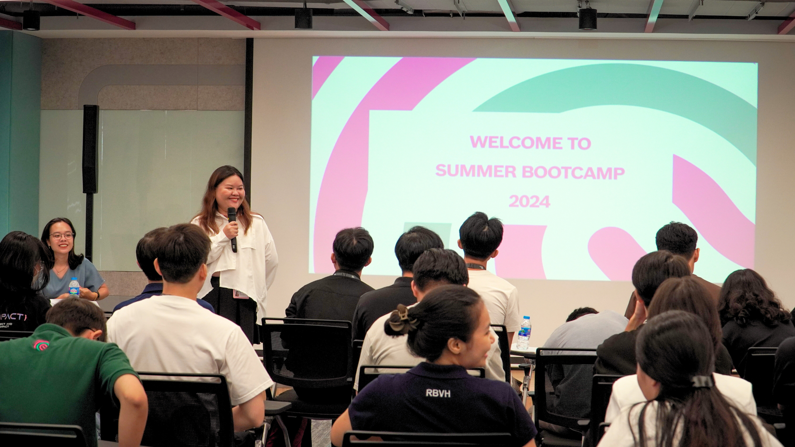
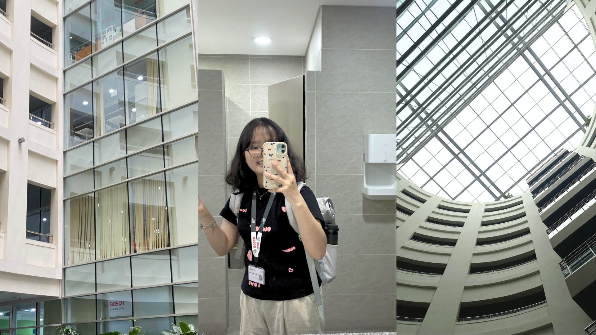
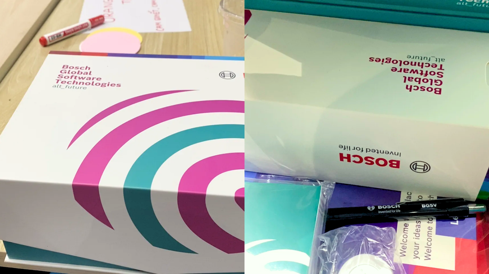
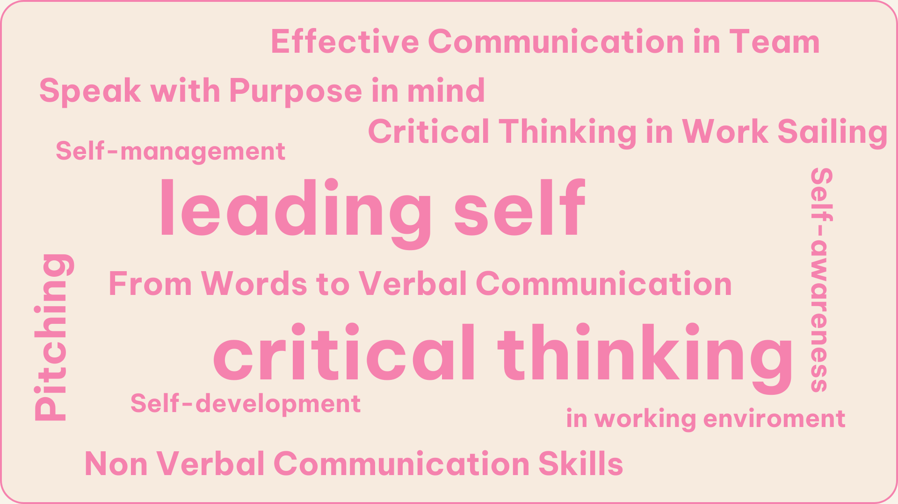
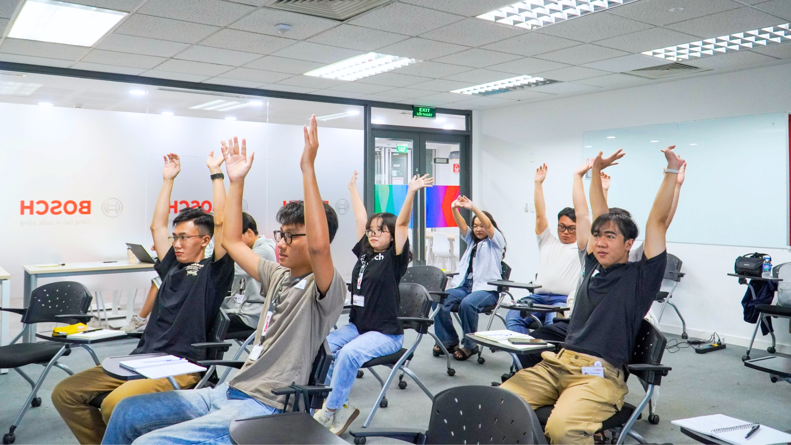
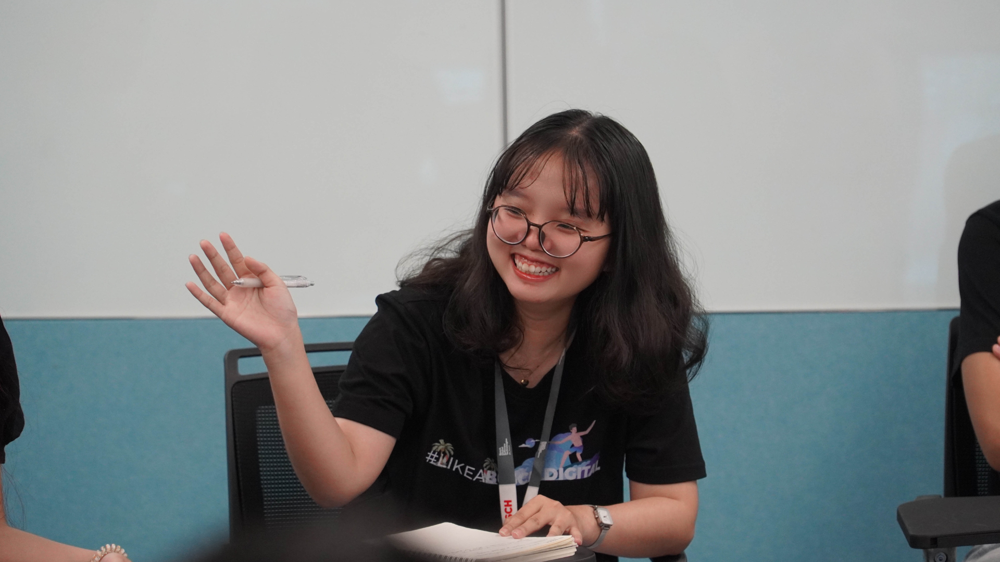
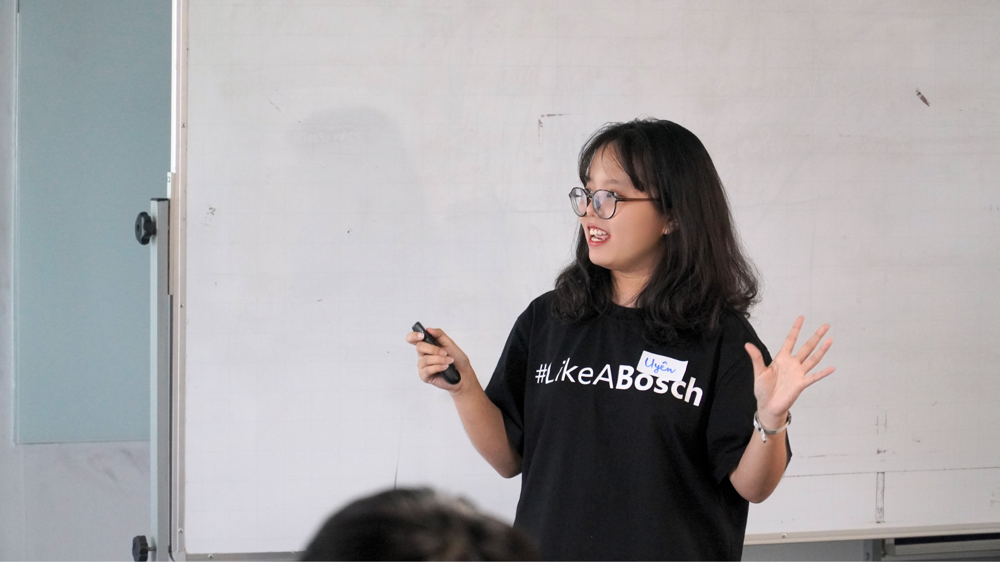
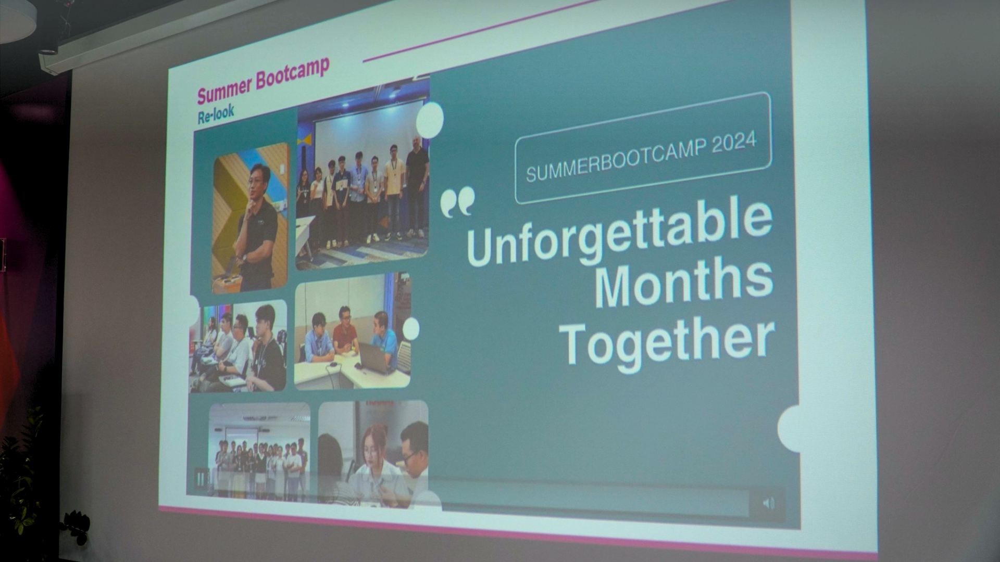

*Đọc bản tiếng Việt ở [đây](https://nnphuyen.netlify.app/blog/cho-hè-thêm-rực-rỡ-với-bosch-summer-bootcamp/) nhé!*

### **Table of Contents**

**[Introduction](#h-introduction)**
**[Chapter 1: early summer days](#h-chapter-1-early-summer-days)**
**[Chapter 2: onboard day and welcome 24 campers](#h-chapter-2-onboard-day-and-welcome-24-campers)**
**[Chapter 3: 8 mornings as an early bird for training at Bosch](#h-chapter-3-8-mornings-as-an-early-bird-for-training-at-bosch)**
**[Chapter 4: the journey of braving the hardships comes to an end](#h-chapter-4-the-journey-of-braving-the-hardships-comes-to-an-end)**

### Introduction

My 3 months participating in the Bosch Summer Bootcamp 2024 and interning at Bosch Global Software Technologies Vietnam will be shared in this post. These were days of experiencing a dream work environment, working alongside associates who supported me during my trip to India, and realizing how different I am when working as an office person.

### Chapter 1: early summer days

At the end of April and the beginning of May, after completing the Data Engineer Zoomcamp, I finally felt quite confident and ready to step into the job market. At that time, I wasn't exactly all-in for Bosch; I simply sent my CV wherever felt right, with a relaxed mindset, not too impatient. Coincidentally, Bosch began promoting the Bosch Summer Bootcamp 2024 program during that period. After reading the job description, which seemed like a great fit, I applied right away.

I really love Bosch, especially BGSV, because, since the previous summer, I’ve had the opportunity to work with and experience the company through programs like One Day Boschler 2023, SPARK OFF, the Activator Scholarship, and a talent exchange trip to India. I genuinely wanted to work at BGSV, so when I submitted my CV, I actively “sent a message to the universe,” and fortunately, everything went smoothly.

My interview process, in a nutshell, was “interview in the morning, offer in the afternoon.” I was the first person to interview for the Data Engineer Intern position (which I applied for, and it focuses on low-code solutions). This position was only open for one person, and I’m fortunate to have the opportunity to take it. Send a heartfelt message and one day, you’ll work at your dream company!

### Chapter 2: onboard day and welcome 24 campers

After a month of summer break at home, I returned to Saigon to prepare for my first day at work – Onboarding Day. It was a sunny mid-June day, and after traveling more than 20 km from the "university village" to the company, Bosch welcomed me with an incredibly warm and joyful onboarding session.

The onboarding day at Bosch gave me a very different feeling. Instead of jumping straight into work, we spent the entire day getting to know each other and learning about the company’s policies and regulations. We listened, played games, and got to meet other associates, even from different departments. We had our company ID photos taken, submitted the necessary paperwork, received guidance on company policies, learned about employee benefits, and even played team-building games together. By the end of the day, the team’s Buddy members came to welcome us (this time, our department had three new members: two interns and one associate). We met our associates, and got to see where we’d be working in the coming months.

After the onboarding day, I also attended the Opening Ceremony of the Summer Bootcamp 2024, where I met and connected with nearly 17 other talented Campers. The opening gave me a broader view of the challenging three-month internship ahead, which, as HR mentioned, would be "hardcore" compared to a typical internship program. This is because we are only interning for three months, half the time of regular interns at BGSW, while also attending soft skills training sessions and working in teams to tackle program challenges. I also had the chance to meet and interact with the HR Buddy, my Mentors, and other Campers through fun icebreaker games. Even though it’s only been two days at work, I’m already filled with excitement for the 90 days ahead.

### Chapter 3: 8 mornings as an early bird for training at Bosch

Work is not just about working, it’s also about learning. During my 12-week internship at Bosch, I didn’t just complete assigned tasks, but I was also taught critical thinking, turning ideas into reality, and even pitching. This is both a distinction and a privilege for the interns in the Summer Bootcamp program.

To minimize mistakes, learn effectively, and identify the right path, the first step is to understand yourself. That’s why 'Leading Self' was the first topic I was taught (during the first two sessions) in the soft skills training series. The three main themes of this topic are Self-Awareness, Self-Management, and Self-Development.

> *To know oneself is true progress*

Self-awareness means self-reflection to understand key aspects of yourself, including your core values, beliefs, emotions, and identity, so that you can determine who you are and who you want to become. The training taught me how to understand myself better, not be afraid when I haven't found the right answer, and learn to persevere step by step to create a great whole.

We all sometimes feel overwhelmed and exhausted, and that’s a signal for us to take a break. Self-management - being organized and having clear plans - helps us balance life more effectively. Hard work is good, but our bodies also need rest and care. In learning about self-management at Bosch, I came to understand that while stress is inevitable, how I understand and face it is something I can control. This gives me the inner strength to continue learning, growing, and “leveling up.” At Bosch, self-development is tied to the growth mindset - being ready to face challenges, seeing difficulties as learning opportunities, and persevering through adversity. As a Boschler, I’ve not only stepped out of my comfort zone but also overcome fears, embracing learning and improving myself every day.

> *Be yourself, but better.* 

After the topic of Leading Self came the series of training on Critical Thinking in Communication, where we learned everything about critical thinking and how to effectively express ideas and communicate with others. I went through numerous lessons on generating ideas, expressing those ideas, presenting, and engaging in critical discussions.

I learned a lot of great things through these topics, but the most impressive for me were the two practice sessions on Topic Debates (under the topic of Critical Thinking in Work Sailing topic) and Presenting a Technological Aspect (under the topic of From Words to Verbal Communication topic). I had never participated directly in a formal debate before - at most, it was just discussions or arguments about a topic. I’ve always admired how people present their knowledge, defend their viewpoints, and at the same time listen to others to enrich their understanding. It reminded me of watching Trường Teen on television when I was younger. Thanks to the Summer Bootcamp this summer, I finally got the chance to experience something I had wanted to try since I was a kid. I learned how to turn my thoughts into well-structured arguments, backed by clear evidence to persuade the opposing side. At the same time, I learned how to listen and analyze quickly during the debate. One important thing my mentor constantly reminded us of was to always respect others with opposing opinions, because everyone has their own perspective. Debating doesn’t mean criticizing or arguing; it’s about presenting viewpoints and discussing how the other side perceives an issue that isn’t about right or wrong.

I also had the chance to participate in many practice sessions sharing knowledge during the 3-month bootcamp. From mentors to content and the support of the organizing team, everything was excellent. But what I value most is the incredibly detailed and thoughtful feedback I received from the organizers. Just like with debating, I had never attended a class that truly taught presentation skills. At school, I’ve presented in front of groups many times, but those were simply project or study result reports, not sessions where weaknesses in my presentation style were addressed. I always thought that the goal was to convey the content, not the manner in which I did it. But during the Summer Bootcamp, my mentors clearly pointed out my weaknesses and guided me on how to improve. I was genuinely surprised by the feedback, as it meticulously covered everything - from how I presented my ideas, verbal language, body language, to my tone of voice. This level of detail and care in their feedback is something I truly appreciate.

### Chapter 4: the journey of braving the hardships comes to an end

The three-month journey of the Summer Bootcamp, while not too long, was definitely not short either, and it has now come to an end. I got to meet and make a few new friends, learned about many talented people, and gained a lot of new knowledge. My summer journey with the Summer Bootcamp wouldn’t have been complete without the HR team (especially Ms. V.A, Ms. H., and Ms. K.), my fellow teammates (Nh., B., Tr., Ph., and T.), and especially the NLC3 associates and my mentor, Mr. Th., who was incredibly dedicated and helped me so much during my three-month internship at BGSV.

After three months, I’m fortunate that my journey with Bosch continues. I’m still a Boschler, working alongside BGSV, but in a new and even more exciting role. I believe that the end of this journey is just the beginning of an even brighter one ahead.

