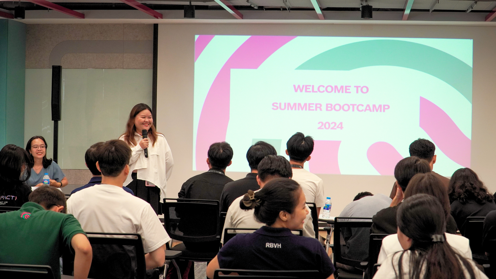
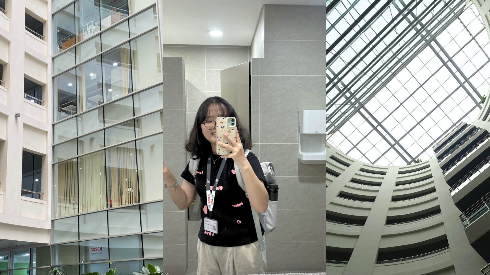
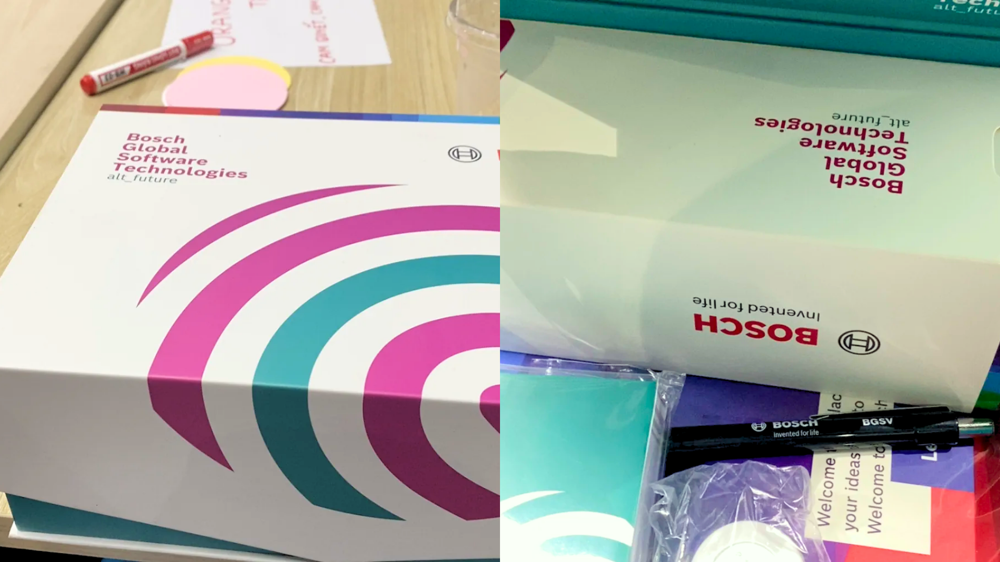
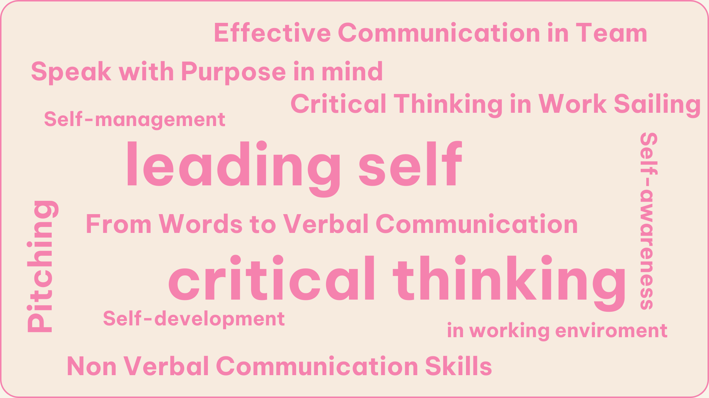
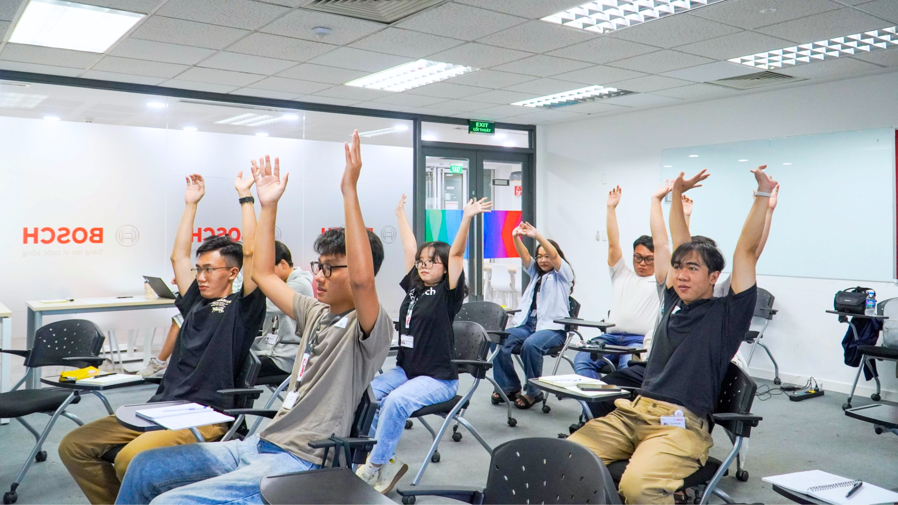
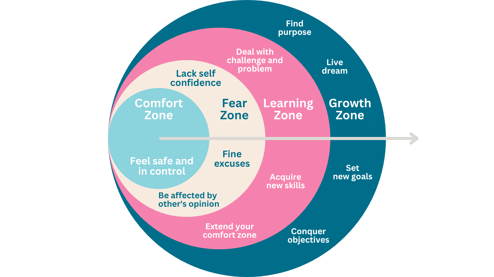
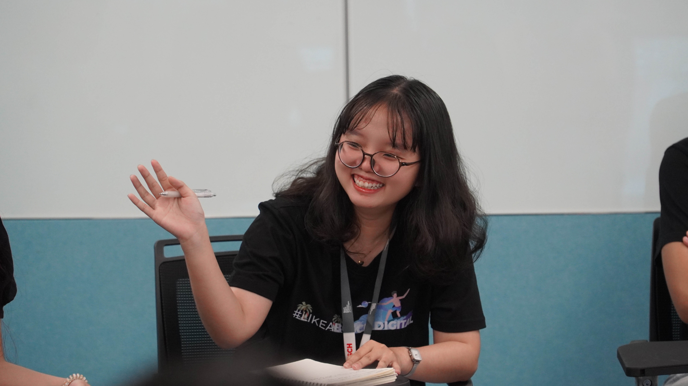
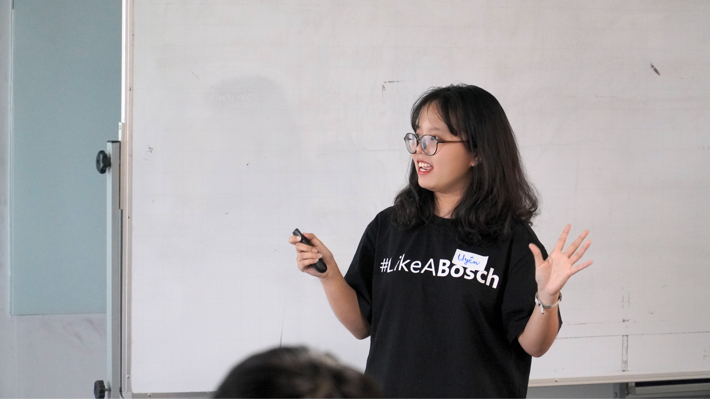
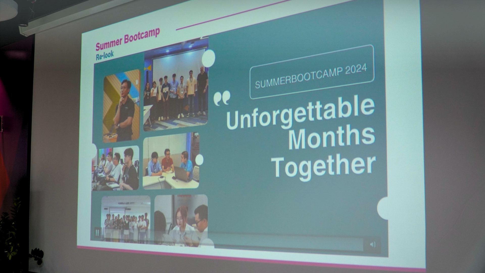

*Please check for English version here**!*

### **Mục lục**

**[Giới thiệu](#h-giới-thiệu)**
**[Chương 1: những ngày đầu hè](#h-chương-1-những-ngày-đầu-hè)**
**[Chương 2: onboard và chào mừng 24 tân binh](#h-chương-2-onboard-và-chào-mừng-24-tân-binh)**
**[Chương 3: 8 ngày làm chim sâu dậy sớm học về kỹ năng mềm](#h-chương-3-8-ngày-làm-chim-sâu-dậy-sớm-học-về-kỹ-năng-mềm)**
**[Chương 4: kết thúc hành trình “vượt chông gai”](#h-chương-4-kết-thúc-hành-trình-vượt-chông-gai)**

### Giới thiệu

3 tháng tham gia Bosch Summer Bootcamp 2024 và thực tập tại công ty Bosch Global Software Technologies Vietnam sẽ được mình kể lại trong bài viết này. Là những ngày trải nghiệm môi trường làm việc trong mơ, đồng hành cùng những cộng sự đã giúp đỡ mình trong chuyến đi Ấn, và nhận ra bản thân mình thật khác khi làm một nhân viên văn phòng.

### Chương 1: những ngày đầu hè

Cuối tháng Tư đầu tháng Năm, sau khi hoàn thành khoá Data Engineer Zoomcamp thì cuối cùng mình cũng cảm thấy khá ổn, tự tin để đi bước vào thị trường lao động. Đợt đấy mình cũng không hẳn là all-in-Bosch mà là cảm thấy ở đâu ổn thì mình sẽ gửi CV, nhưng với tâm thế thoải mái chứ không quá nôn nóng. Trùng hợp là giai đoạn đó Bosch cũng bắt đầu truyền thông cho chương trình Bosch Summer Bootcamp 2024, đọc mô tả công việc các thứ khá là phù hợp, nên là nộp luôn.

Mình thích Bosch cực, đặc biệt là BGSV, vì từ hè năm trước mình đã có cơ hội làm việc và trải nghiệm với các cộng sự của công ty từ One Day Boschler 2023, SPARK OFF, đến Activator Scholarship và chuyến trao đổi tài năng tại Ấn Độ. Mình thật sự rất muốn làm việc tại BGSV nên lần gửi CV này mình đã tích cực “gửi thông điệp tới vũ trụ”, và trộm vía là mọi thứ suông sẻ. 

Ngắn gọn quá trình phỏng vấn của mình chính là “sáng phỏng vấn, chiều có offer”. Mình là người đầu tiên phỏng vấn cho vị trí Data Engineer Intern (đây là vị trí mà mình apply nhé và nó lại theo hướng low-code), vị trí này chỉ tuyển một người thôi và thật may vì mình có cơ hội để đảm nhận nó. Có tâm gửi thông điệp, có ngày được làm ở công ty mơ ước!

### Chương 2: onboard và chào mừng 24 tân binh

Sau 1 tháng nghỉ hè ở nhà, mình quay trở lại Sài Gòn để chuẩn bị cho ngày đầu tiên đi làm - Onboarding Day. Đó là một ngày giữa tháng Sáu nắng đẹp, từ làng đại học, đi hơn 20 km, để đến công ty và Bosch chào đón mình bằng buổi onboard cực kỳ ấm áp và vui vẻ. 

Ngày Onboard tại Bosch cho mình một cảm giác rất khác biệt, không gấp gáp nhảy vào công việc mà dành cả một ngày để các cộng sự quen thuộc và hiểu rõ về các quy chế quy định của công ty. Bọn mình được nghe, được chơi và được làm quen với các cộng sự khác dù không cùng phòng ban. Chụp ảnh thẻ công ty nè, nộp các giấy tờ cần thiết nè, được hướng dẫn về các quy định nè, biết được các đặc quyền của cộng sự nè và còn được chia nhóm để chơi game cùng nhau nữa. Đến cuối ngày thì các chị team Buddy của phòng mình cũng đón tụi mình (đợt này phòng mình có thêm 3 thành viên mới, 2 bạn intern và 1 chị là associate) lên để chào hỏi các anh chị khác, gặp Sếp, gặp đồng nghiệp và biết được chỗ bọn mình sẽ làm việc trong thời gian tới như thế nào.

Sau ngày onboard mình còn được tham gia buổi Opening Ceremony riêng của chương trình Summer Bootcamp 2024 và được gặp gỡ và kết nối trực tiếp với gần 17 bạn Campers tài năng khác. Buổi opening giúp mình có một cái nhìn toàn cảnh hơn về 3 tháng thực tập đầy chông gai tới, mà như các chị HR nói sẽ "hardcore" hơn so với một chương trình thực tập bình thường. Vì tụi mình chỉ thực tập 3 tháng, bằng một nửa thời gian so với thực tập sinh bình thường ở BGSW, nhưng đồng thời tụi mình còn phải tham gia các khoá huấn luyện kỹ năng mềm, làm việc nhóm để giải quyết các thử thách mà chương trình đặt ra. Ngoài ra mình còn được gặp gỡ và giao lưu với các anh chị HR Buddy, và Mentors của mình cũng như các bạn khác thông qua những trò chơi giao lưu nhỏ. Chỉ mới hai ngày đi làm thôi mà mình đã tràn đầy chờ mong vào 90 ngày sắp tới rồi.

### Chương 3: 8 ngày làm chim sâu dậy sớm học về kỹ năng mềm

Đi làm, không chỉ làm, mà còn được học. 12 tuần thực tập ở Bosch, mình không chỉ hoàn thành các công việc được giao và học về các làm việc, ứng dụng kiến thức trên trường đại học vào thực tế mà còn được dạy về tư duy phản biện, biến những ý tưởng thành thực tế và thậm chí là cả về pitching. Đây vừa là khác biệt mà cũng là đặc quyền của những thực tập sinh trong khuôn khổ chương trình Summer Bootcamp.

Để giảm thiểu sai lầm, học tập hiệu quả, xác định được lộ trình phù hợp thì điều đầu tiên là phải hiểu được bản thân mình, đó cũng là lí do vì sao Leading Self là topic đầu tiên mình được dạy (2 buổi đầu tiên) trong chuỗi training về kỹ năng mềm. 3 chủ đề chính của topic này là Self-Awarenes, Self-Management, và Self-Development.

> *Biết người biết ta, trăm trận trăm thắng.*

Self-awareness, tự nhìn nhận bản thân mình để hiểu rõ về các khía cạnh bao gồm giá trị bên trong, niềm tin, cảm xúc và bản ngã của cuộc đời, từ đó xác định được mình là ai và đâu là con người mình muốn trở thành. Buổi training dạy cho mình cách để hiểu rõ mình hơn, không sợ hãi khi chưa tìm được đáp án đúng và học cách kiên trì từng bước một để tạo thành một tổng thể to lớn. Ai rồi cũng có lúc cảm thấy quá tải, mệt mỏi và đó là tín hiệu để bản thân của mình nghỉ ngơi. Self-management, tổ chức quản lý bản thân rõ ràng, có kế hoạch sẽ giúp chúng ta điều hoà cuộc sống hợp lí hơn. Làm việc chăm chỉ là tốt, nhưng đồng thời cơ thể chúng ta cũng cần được nghỉ ngơi và xoa dịu. Học về quản lí bản thân tại Bosch, mình hiểu được rằng, stress là điều không thể tránh khỏi nhưng hiểu nó và đối mặt với nó lại là điều mà bản thân mình có thể quyết định được. Từ đó giúp bản thân có thêm nội lực để học hỏi thêm, phát triển thêm và “lớn lên” thêm. Ở Bosch, self-development gắn liền với tư duy cầu tiến (growth mindset), luôn sẵn sàng đối mặt với chông gai, xem khó khăn là cơ hội để học tập, và bền bỉ với thử thách. Là một Boschler, mình không chỉ bước ra khỏi vùng an toàn của bản thân mình mà còn vượt qua những sợ hãi, sẵn sàng học tập và giúp bản thân tốt hơn mỗi ngày. 

> *Be yourself but better.*

Sau topic Leading Self là chuỗi training về Tư duy phản biện trong giao tiếp, học tất tần tật cả về tư duy phản biện và các cách thể hiện ý tưởng, giao tiếp với mọi người thật hiểu quả. Mình đi qua hầu như rất nhiều bài học về tạo lập ý tưởng, thể hiện ý tưởng, thuyết trình, và phản biện. Mình đã học được rất nhiều điều hay qua các topic này nhưng nói đến ấn tượng nhất chắc có lẽ là 2 buổi thực hành với Phản biện theo chủ đề (thuộc topic Critical Thinking in Work Sailing) và Thuyết trình một khía cạnh công nghệ (thuộc topic From Words to Verbal Communication). 

Mình chưa từng tham gia trực tiếp một buổi phản biện nào trước đây, có chăng chỉ là đối đáp qua lại về một vấn đề mà thôi. Mình luôn cảm thấy khi mọi người thể hiện hiểu biêt của mình và đứng ra tranh luận để bảo vệ quan điểm của bản thân nhưng đồng thời cũng lắng nghe để làm giàu vốn hiểu biết của bản thật rất ngầu, như lúc nhỏ xem Trường Teen trên truyền hình vậy. Nhờ tham gia Summer Bootcamp hè này mà cuối cùng mình cũng có cơ hội trải nghiệm điều mà bản thân rất muốn thử từ nhỏ. Mình học được cách biến những suy nghĩ của bản thân thành lập luận chặt chẽ, có luận cứ luận chứng rõ ràng để thuyết phục bên đối lập, đồng thời mình cũng học được cách lắng nghe và phân tích nhanh tại chỗ khi buổi tranh biện diễn ra. Một điều quan trọng mà anh mentor luôn nhắc nhở tụi mình là phải luôn tôn trọng các bạn với ý kiến đối lập, vì ai cũng có suy nghĩ riêng của mình, phản biện không có nghĩa là phê phán, là cãi nhau mà là để cùng đưa ra quan điểm và thảo luận xem góc nhìn của đối phương về một vấn đề không có tính đúng hay sai.

Mình cũng được tham gia nhiều buổi thực hành chia sẻ kiến thức trong 3 tháng bootcamp, từ mentor đến nội dung, sự hỗ trợ của ban tổ chức đều rất tốt nhưng điều mình trân quý hơn cả là khi nhận được feedback siêu chi tiết và tận tâm từ các anh chị ban tổ chức. Cũng như phản biện, mình chưa từng tham gia một lớp học dạy thuyết trình thật sự. Ở trường ở lớp mình đã có rất nhiều lần thuyết trình trước tập thể nhưng đó đơn giản là báo cáo lại đồ án, kết quả học tập, không phải là một buổi để feedback những điểm yếu trong cách trình bày của mình. Vì mình hiểu rằng, mục đích của nó nằm ở nội dung mình truyền tải được chứ không nằm ở cách thức mình thực hiện. Nhưng khi tham gia Summer bootcamp, những điểm yếu của mình đã được các anh chị mentor chỉ ra rõ ràng và giúp mình định hướng để cải thiện tốt hơn. Khi nhận được feedback mình đã rất bất ngờ vì từ cách thức thể hiện ý tưởng, ngôn ngữ nói, ngôn ngữ hình thể đến tông giọng cũng được các anh chị tỉ mỉ ghi chú lại để góp ý cho mình ở đoạn sau. Đây chính là điều mà mình thật sự trân trọng. 

### Chương 4: kết thúc hành trình “vượt chông gai”

Ba tháng hành trình không dài nhưng cũng thật sự không ngắn của Summer Bootcamp rồi cũng đến lúc kết thúc. Mình được gặp gỡ và quen thêm một vài người bạn, biết thêm nhiều người tài giỏi và học được rất nhiều điều mới. Hành trình mùa hè của mình cùng  Summer Bootcamp sẽ không trọn vẹn nếu thiếu đi các anh chị team HR (đặc biệt là chị V.A, chị H., và chị K.), các bạn mình làm việc cùng (bạn Nh., bạn B., bạn Tr., bạn Ph., anh T.), đặc biệt là các anh chị trong team NLC3 và anh Th., người mentor siêu có tâm đã giúp đỡ mình rất nhiều trong 3 tháng thực tập tại BGSV. 

Sau ba tháng, may mắn là duyên mình và Bosch vẫn tiếp diễn, mình vẫn tiếp tục là một Boschler cùng đồng hành với BGSV nhưng ở một vai trò khác hơn và cũng tuyệt vời hơn. Và mình tin rằng điểm cuối của hành trình này chính là điểm bắt đầu của một hành trình rực rỡ hơn phía trước.

